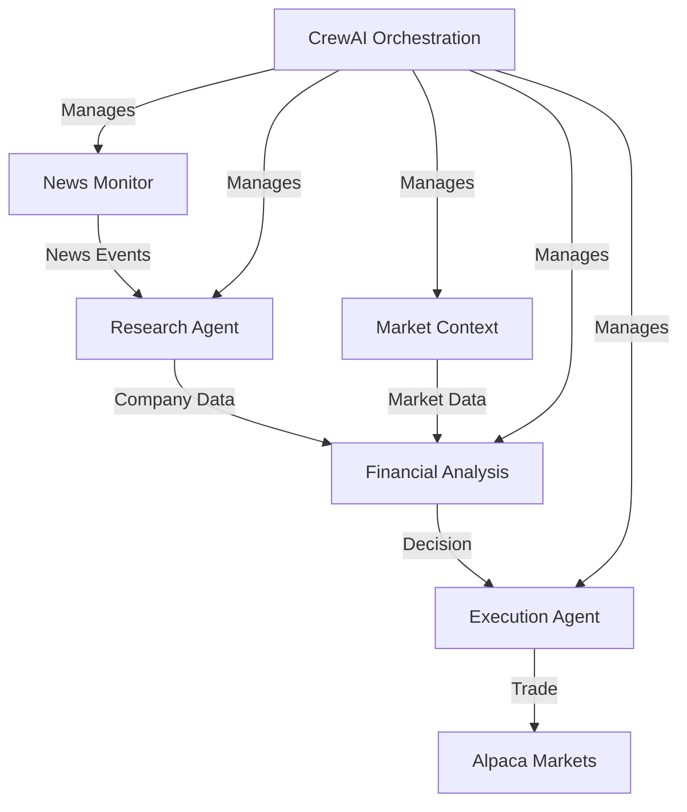

# Intelligent Trading Agents - System Architecture

## 1. System Overview
A terminal-based, AI-powered trading system utilizing CrewAI to orchestrate multiple specialized agents that analyze news, perform research, and execute trades based on predefined criteria.

## 2. Core Components

### 2.1 Agent Architecture (CrewAI-based)
1. **News Monitor Agent**
   - Real-time news tracking via Alpaca WebSocket API
   - Keyword and sentiment analysis
   - Company-specific news filtering
   - Configured via YAML definitions

2. **Research Agent**
   - SEC filings analysis via SerperDevTool
   - Financial document retrieval
   - Historical data correlation
   - Configured via YAML definitions

3. **Financial Analysis Agent**
   - FINRA compliance checking
   - Technical analysis
   - Risk assessment
   - Decision making based on agent inputs
   - Configured via YAML definitions

4. **Market Context Agent**
   - Global market sentiment analysis via SerperDevTool
   - Sector performance tracking
   - Macro trend evaluation
   - Configured via YAML definitions

5. **Execution Agent**
   - Alpaca Markets API integration via custom tool
   - Order management
   - Position tracking
   - Configured via YAML definitions

### 2.2 Data Flow

## 3. Technical Stack
- **Core Framework**: CrewAI for agent orchestration
- **Storage**: Local JSON files + SQLite for historical data
- **Interface**: Terminal-based CLI with rich formatting
- **Custom Tools**: 
  - AlpacaNewsTool (WebSocket connection for real-time news)
  - AlpacaTradingTool (for trade execution)
  - FileReadTool (for configuration)
- **APIs**:
  - Alpaca Markets (trading)
  - SerperDev (for web search)

## 4. Testing & Simulation

### 4.1 Paper Trading Mode
- Real-time data processing
- Simulated trade execution via Alpaca paper trading
- Performance tracking in local SQLite database
- Risk monitoring via terminal dashboard

### 4.2 Historical Simulation
- Replay historical market data
- Agent behavior validation
- Strategy refinement
- Performance metrics calculation

## 5. CrewAI Integration

### 5.1 News Monitoring Service
- WebSocket connection to Alpaca's news stream
- Real-time filtering of news by ticker symbols
- News event triggering of CrewAI workflow
- Sentiment pre-analysis using LLM

### 5.2 Agent Configuration
- YAML-based agent definitions
- Role, goal, and backstory for each agent
- Tool assignments based on agent specialization

### 5.3 Task Configuration
- YAML-based task definitions
- Clear expected outputs
- Agent assignment
- Sequential process flow

### 5.4 Crew Lifecycle Hooks
- `@before_kickoff`: Validate inputs, check market status
- `@after_kickoff`: Log results, save trading history

## 6. Security & Compliance
- API key management via environment variables
- Trade limit enforcement in custom trading tool
- FINRA compliance checking in agent prompts
- Audit trail maintenance via logging

## 7. Deployment
- Single Docker container deployment
- Simple CLI interface
- Configuration via YAML files
- Logging to local files

## 8. Future Enhancements
- Additional custom tools for specialized data sources
- Agent memory for improved decision making
- Portfolio optimization
- Risk management features
